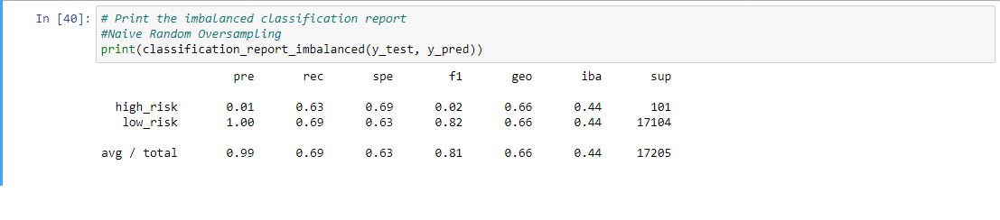
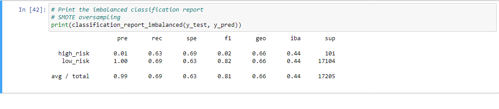
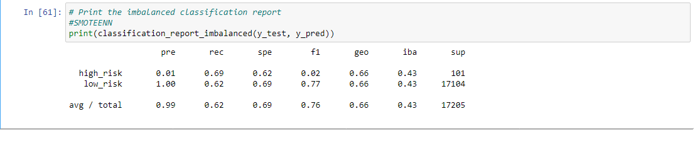
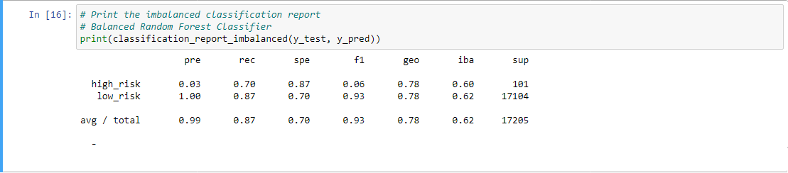
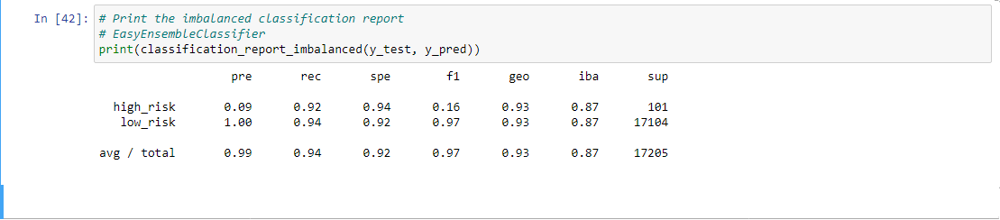

# Credit Risk Analysis

## Overview

The aim of this project is to take credit application data provided by LendingClub
to create a machine learning model for predicting risk. We'll be using 3 algorithms,
RandomOverSampler, SMOTE and the ClusterCentroids algorithms.

## Results
### Naive Random Oversampling

### SMOTE Oversamplin

### Cluster Centroids Resampler

### SMOTEEN

### Random Forest

### Easy Ensemble Classifier

## Summary
