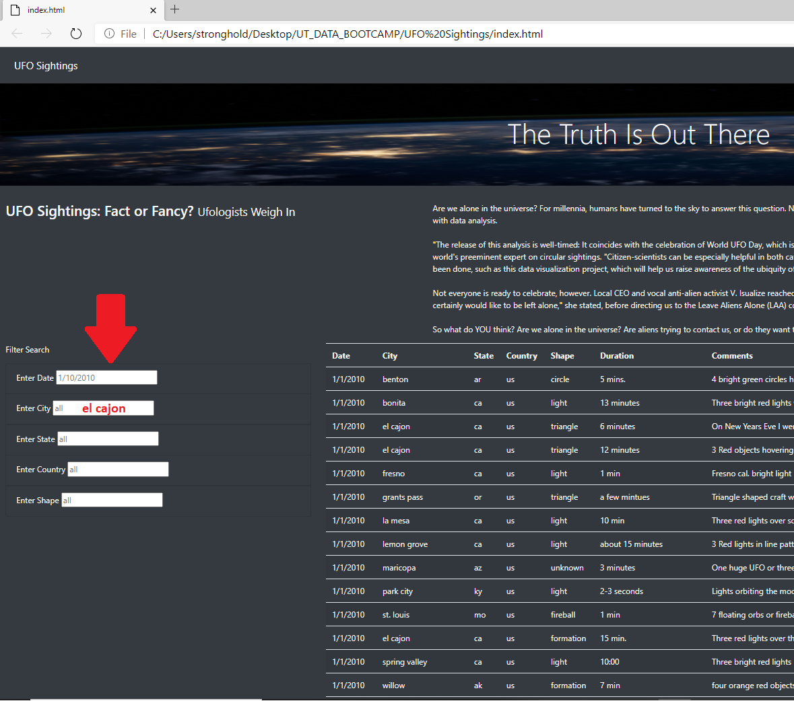
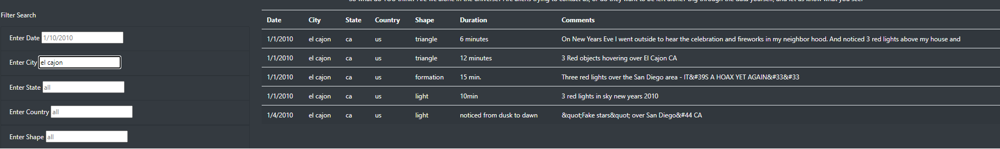

##UFO Sightings!

Dana our data journalist friend has just received the opportunity to write about
UFO sightings on her hometown. All she has to go by is a Javascript file filled
with reporting sightings. Dana decided compile the data into a table to post along
side her article!

### Overview of Analysis
For this project, we're using a combination of javascript, html, css, bootstrap and
d3 to present our data in an easy to read table that has a filtering function.

### Results
This page is very easy to use, a user enters their filtering criteria into the
text boxes on the center left as pictured below.

In this example we'll be using the city of "el cajon". Once entered the user just
needs to press enter or click outside the box and the table should automatically
update the results as seen below.

### Summary
While this table is great one serious drawback is that the page cannot display
results for more than 1 filtering criteria at a time. Further development would
allow for multiple filters. Another great function that we can add at a later time
is an export function. That way data can be downloaded to a users preferred data
format for further analysis.
