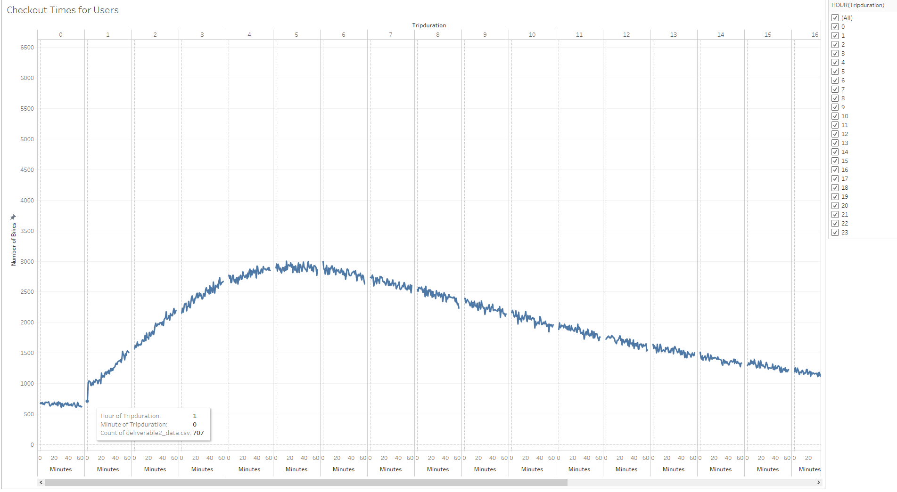
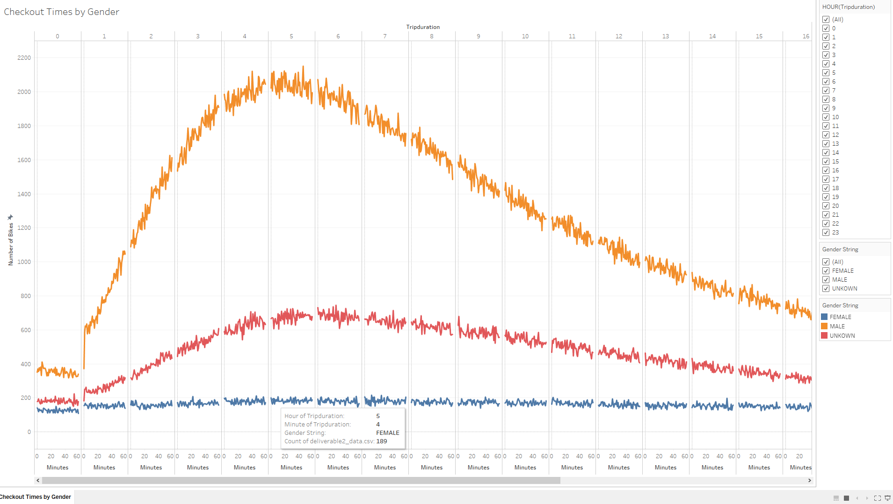
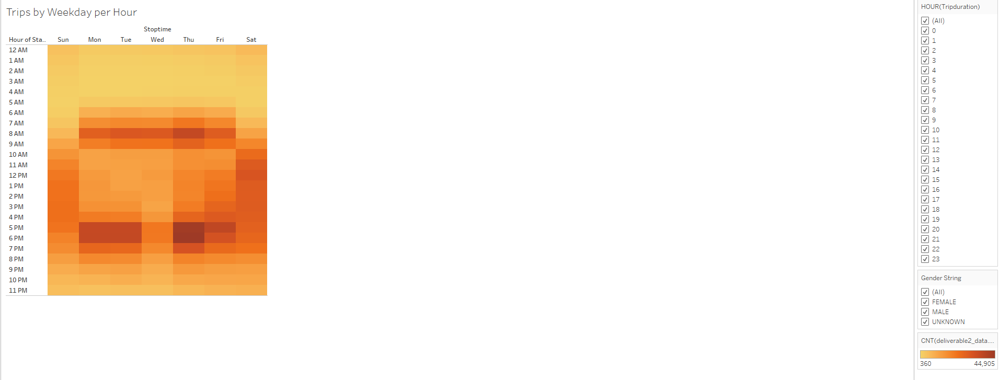
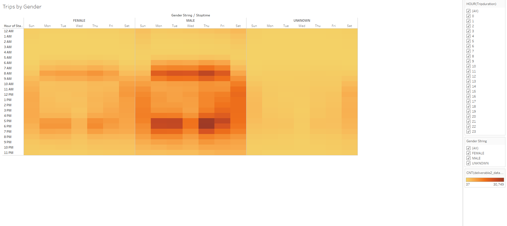
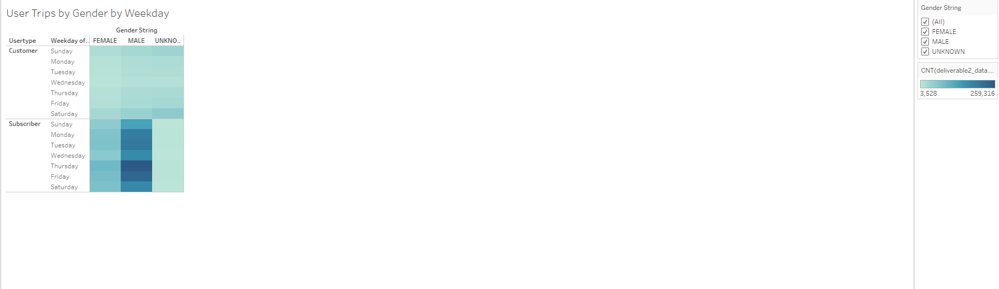

# Bikesharing

## Overview

- This project aims at providing insight into a potential investment opportunity
for a bikesharing business by analyzing data from the New York City Citibike program.
To do this we do graphical analysis of a dataset of August 2019 containing 2.3 million
datapoints. This data was transformed on a Jupyter Notebook using python and visualized
using Tableau.

## Results

- This graph shows all the rentals that happened on this month. As we can se bike rentals
of 4 to 7 hours were the most common. We also see a spike in rental duration at the
beggining of every hour.

- This graphy shows all the bike rides done in August broken down by gender. As shown
there is a significantly larger number of bike rides by males.

- Here we see that a majority of bike trips happen during the commute hours during
the week while while on weekends they are a bit more constant during the day.

- This graph is similar to the Trips by Hour by Day of Week but it's broken down by
individual genders. The pattern held the same for male and female but we saw that
use was heavier for people with unkown gender during the weekend. This could be due to
people running into bikes in their free time and installing the app for the first time
but not taking the time to fully fill out the info in the app. Most likely tourists
or people who are gonna be 1 time riders.

- This graph shows that a majority of users tend to be Male and subscribers rent
the bikes the most during the week. It also shows that the majority of non subscribers
rent bikes during the weekends like showed on the previous graph.

### Summary
- The main insight that we got from this visualization is that the people of
New York City are using these bikes as a form of transportation. A good business
model to incorporate would be the subscriber model to reflect that. We're also seeing
that during weekends bike rentals tend to be made by non subscriber and people who
are not fully filling out the app info, perhaps because they're first time users.

-For future refence we could analyze other months and see how tourism friendly dates
and cold weather affect rentals.

### Link to Tableau Story:
[link to Tableau Story](https://public.tableau.com/profile/jp4411#!/vizhome/Book1_16042649545070/Citibike?publish=yes)
